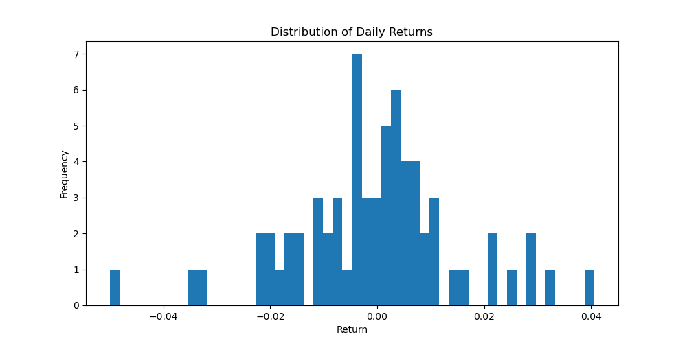
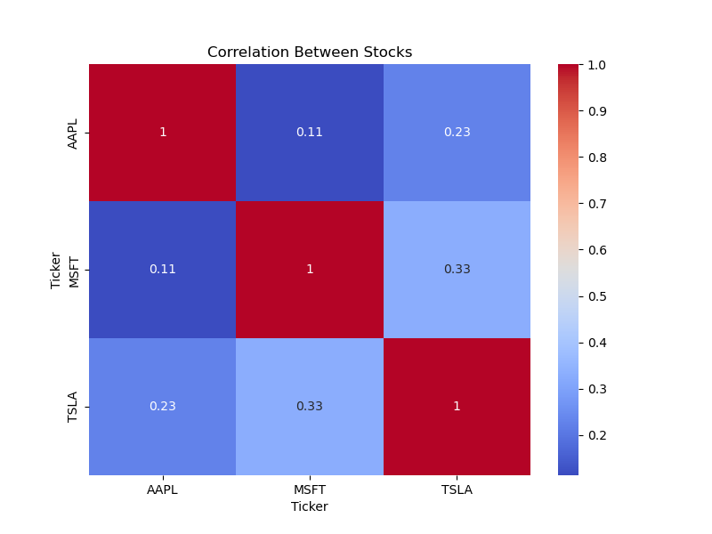

# Stock Price Analysis using Python

## Objective
Analyze stock price data to understand return, volatility, and correlation between assets.

## Tools
Python, pandas, matplotlib, seaborn, yfinance

## Key Steps
- Collected historical stock data using yfinance
- Cleaned and processed data using pandas
- Calculated daily returns and volatility
- Visualized price trends and return distribution
- 
- 

- Analyzed correlation between multiple stocks
- 

## Results
- Identified differences in risk and return across stocks
- Observed that most daily returns are close to zero
- Found varying levels of correlation between assets, implying diversification potential
