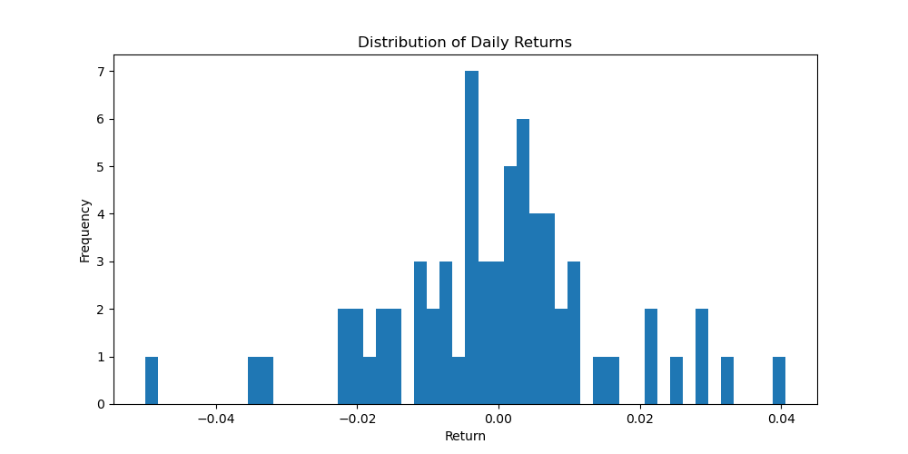
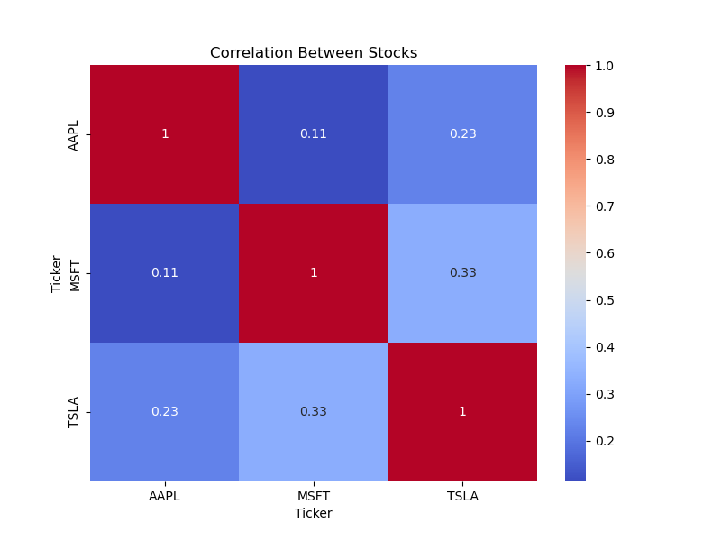

# Stock Price Analysis using Python

## Objective
Analyze stock price data to understand return, volatility, and correlation between assets.
**Data**: AAPL, MSFT, TSLA | Jan–Apr 2026 | Source: Yahoo Finance via yfinance

## Tools
Python, pandas, matplotlib, seaborn, yfinance

## Key Steps
- Collected historical stock data using yfinance
- Cleaned and processed data using pandas
- Calculated daily returns and volatility
- Visualized price trends and return distribution
- 
- 

- Analyzed correlation between multiple stocks
- 

## Results
- AAPL mean daily return: -0.05% | daily volatility: 1.56% (Jan–Apr 2026)
- AAPL/MSFT/TSLA correlation: moderate to high positive correlation 
  (see heatmap) — limited diversification benefit within this portfolio
- Return distribution approximately normal with slight negative skew
  
